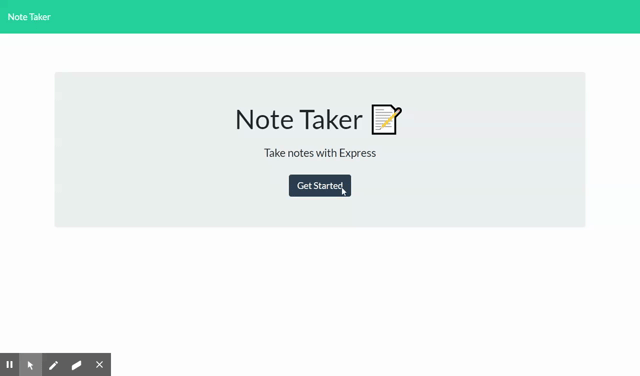
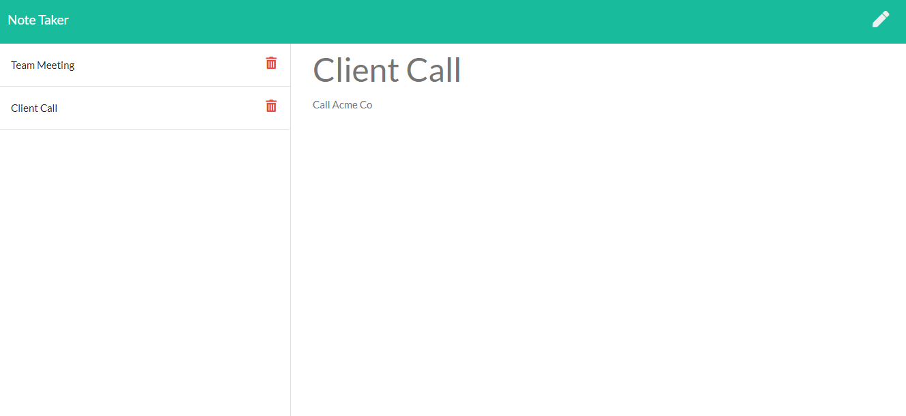
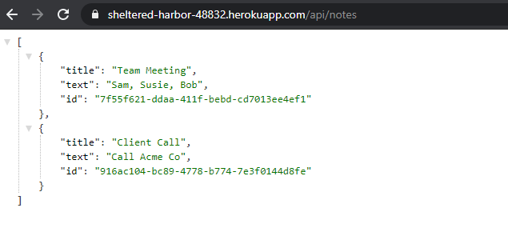

# Notes App
  

  ## Description
  
  Notes App is used for creating and storing notes so users can stay organized. 
  
  ---
  
  ## Table of Contents
  
  - [Installation](#installation)
  - [Usage](#usage)
  - [Credits](#credits)
  - [Contributing](#contributing)
  - [Tests](#tests)
  - [Questions](#questions)
  - [License](#license)
  
  ---
  
  ## Installation
  
  No installation is required. Simply visti the URL for the active website listed below.
  
  URL for active webpage: [https://sheltered-harbor-48832.herokuapp.com/](https://sheltered-harbor-48832.herokuapp.com/)

  URL for API: [https://sheltered-harbor-48832.herokuapp.com/api/notes](https://sheltered-harbor-48832.herokuapp.com/api/notes)
  
  URL for repository: [https://github.com/tonyschwebach/notes-app](https://github.com/tonyschwebach/notes-app)
  
  ---
  
  ## Usage
  
  Website:
  1. Visit active website.
  2. Click "Get Started".
  3. Enter your note title and details in the placeholder text on the right side of the app. (New notes can also be created by clicking the pencil icon.)
  4. Click the save icon to save the note.
  5. View saved notes by clicking them on the left side of the app.
  6. Delete saved notes by clicking the trash icon.
  

  
  [Demo](https://drive.google.com/file/d/1SW8uBfKw3q5S3OMA82VJnJhPWVxs3Mm9/view?usp=sharing)

  

  Note Taking

  

  API Response

  
  
  ---
  
  ## Credits
  
  Thank you to the Georgia Tech instructional staff and the full-time full-stack development cohort.
  
  
  ---
  
  ## Contributing

  Not currently accepting contributions
  
  ---
  
  ## Tests

  N/A
  
  ---
  
  ## Questions
  
  Please contact [tony.schwebach.developer@gmail.com](mailto:tony.schwebach.developer@gmail.com) or tonyschwebach on [Github](https://github.com/tonyschwebach/).
   
  ---
  
## License

MIT License

Copyright (c) [2021] [tonyschwebach]
    
Permission is hereby granted, free of charge, to any person obtaining a copy
of this software and associated documentation files (the "Software"), to deal
in the Software without restriction, including without limitation the rights
to use, copy, modify, merge, publish, distribute, sublicense, and/or sell
copies of the Software, and to permit persons to whom the Software is
furnished to do so, subject to the following conditions:

The above copyright notice and this permission notice shall be included in all
copies or substantial portions of the Software.

THE SOFTWARE IS PROVIDED "AS IS", WITHOUT WARRANTY OF ANY KIND, EXPRESS OR
IMPLIED, INCLUDING BUT NOT LIMITED TO THE WARRANTIES OF MERCHANTABILITY,
FITNESS FOR A PARTICULAR PURPOSE AND NONINFRINGEMENT. IN NO EVENT SHALL THE
AUTHORS OR COPYRIGHT HOLDERS BE LIABLE FOR ANY CLAIM, DAMAGES OR OTHER
LIABILITY, WHETHER IN AN ACTION OF CONTRACT, TORT OR OTHERWISE, ARISING FROM,
OUT OF OR IN CONNECTION WITH THE SOFTWARE OR THE USE OR OTHER DEALINGS IN THE
SOFTWARE.
  
